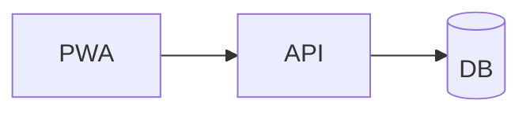

# Slidev Deck Scaffold

> **Purpose**: Scaffold a developer-focused deck with Vue components, syntax-highlighted code, and presenter mode.
> **MCP Validated**: 2026-04-30

## When to Use

- Code-heavy technical talks where line-by-line highlighting matters
- Need presenter mode, drawing, and laser-pointer features
- Audience is developers; deck author is comfortable with Node tooling
- Will export to PDF and / or SPA

## Implementation

```markdown
---
theme: default
title: Module 1 Walkthrough
info: |
  Module 1: Workforce & Attendance demo
  Engineering review, 30 minutes
class: text-center
highlighter: shiki
lineNumbers: true
drawings:
  persist: false
mdc: true
---

# Module 1
## Workforce & Attendance

Press <kbd>Space</kbd> to advance · <kbd>O</kbd> for overview

<!--
Speaker note: 30 min total. Save 5 min for Q&A.
-->

---

# Agenda

- Why this exists
- Architecture mental model
- Live demo
- Edge cases
- Takeaways

---
layout: two-cols
---

# Architecture

::default::

- PWA (offline-capable)
- FastAPI (auth boundary)
- Postgres (source of truth)

::right::



---
layout: image-right
image: ./screenshot.png
---

# Check-in flow

The PWA captures GPS, photo, and timestamp before any
network call. Sync happens in the background once
connectivity returns.

---

# Demo: check-in handler

```python {2-4|6|all}
@router.post("/checkin")
async def checkin(
    payload: CheckInPayload,
    user: User = Depends(get_current_user),
):
    return await service.record(user.id, payload)
```

<!--
Step through highlights with arrow keys.
Line 6 is where the auth + service compose.
-->

---
layout: cover
---

# Three takeaways

1. Offline-first PWA
2. Single auth boundary
3. Auto-generated reports

Thanks. Questions?
```

## Configuration

| Setting | Default | Description |
|---------|---------|-------------|
| `theme` | `default` | npm package or local theme |
| `highlighter` | `shiki` | `shiki` or `prism` for code |
| `lineNumbers` | `false` | Show line numbers in code blocks |
| `mdc` | `false` | Enable MDC (Markdown Components) syntax |
| `class` | none | CSS class on the cover slide |
| `info` | none | Metadata shown in PDF / SPA export |

## Layouts

Per-slide frontmatter selects a layout. Built-in layouts include:

| Layout | Slots | Use For |
|--------|-------|---------|
| `default` | content | Plain bullets and text |
| `cover` | content | Title slide or section divider |
| `center` | content | Centered single-message slide |
| `two-cols` | `::default::`, `::right::` | Side-by-side compare |
| `image-left` / `image-right` | content + `image:` frontmatter | Visual + bullets |
| `quote` | content | Pull-quote |
| `fact` | content | Big-number callout |
| `statement` | content | Single bold sentence |
| `iframe` / `end` | content | Live embed / closing slide |

## Code Block Highlighting

Step-through line highlighting is unique to Slidev:

```markdown
\`\`\`python {1-3|5|all}
def first():
    pass
def second():
    pass
def third():
    pass
\`\`\`
```

Press space to advance through highlight steps. The `|` separates frames; `all` reveals everything.

## Build Commands

```bash
# Scaffold a new deck
npm init slidev@latest

# Dev server with hot reload (presenter mode)
npm run dev

# Build SPA
npm run build

# Export to PDF
npm run export
```

## Example Usage

```markdown
---
theme: seriph
---
# Pitch
---
layout: fact
---
# 6 hrs/week
Manual time tracking, every team.
```

## Common Pitfalls

| Don't | Do |
|-------|-----|
| Reference images by absolute path | Place images next to `slides.md`; use `./img.png` |
| Forget `::right::` slot in `two-cols` | Both slots required, even if one is empty |
| Use `layout: image-right` without `image:` | The frontmatter `image:` key is required |
| Skip `<!-- speaker notes -->` | Slidev's presenter mode shines when notes exist |

## See Also

- [marp-deck-scaffold](marp-deck-scaffold.md)
- [formats-overview concept](../concepts/formats-overview.md)
- Official docs: <https://sli.dev/builtin/layouts>
